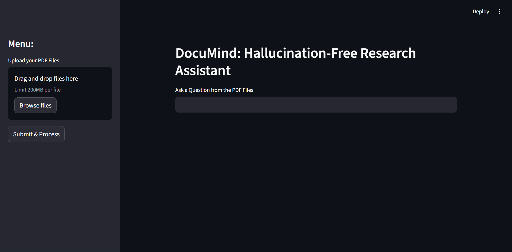

# 🧠 DocuMind: Hallucination-Free Research Assistant


**DocuMind** is an Enterprise-Grade RAG (Retrieval-Augmented Generation) system designed to solve the "Black Box" problem of standard LLMs. By grounding responses strictly in uploaded user documents, it eliminates hallucinations and provides verifiable, citation-backed answers for research and legal analysis.

---

## 📸 Interface


*(Note: Upload a screenshot of your app here)*

---

## 🏗️ System Architecture

DocuMind utilizes a **Hybrid Cloud Architecture** to balance privacy, speed, and computational efficiency.

```mermaid
graph LR
    A[PDF Upload] --> B(Chunking & Cleaning);
    B --> C{HuggingFace Cloud};
    C -->|Embeddings| D[(FAISS Vector DB)];
    E[User Question] --> C;
    C -->|Query Vector| D;
    D -->|Retrieved Context| F[Google Gemini 1.5];
    F --> G[Final Answer];
Ingestion: PDFs are processed using RecursiveCharacterTextSplitter to preserve semantic context across chunk boundaries (1000 chars/chunk).

Embedding (The Edge Layer): To bypass local hardware constraints (Python 3.14 compatibility), text chunks are sent to HuggingFace's Serverless Inference API (all-MiniLM-L6-v2) for vectorization.

Storage: Vectors are indexed locally using FAISS (Facebook AI Similarity Search) for sub-millisecond retrieval.

Generation: The relevant context + user prompt are fed into Google Gemini 1.5 Flash, configured with strict prompt engineering to refuse ungrounded queries.

🛠️ Tech Stack
Frontend: Streamlit (Rapid prototyping & deployment)

LLM (Reasoning): Google Gemini 1.5 Flash (via API)

Embeddings: HuggingFace Serverless Inference (sentence-transformers/all-MiniLM-L6-v2)

Vector Database: FAISS (CPU Optimized)

Orchestration: LangChain (Core & Community)

Language: Python 3.14

⚔️ Engineering Challenges & Solutions
Building DocuMind required solving several critical infrastructure hurdles:

1. The "DLL Hell" & Python 3.14 Compatibility
Problem: The latest Python 3.14 environment lacked stable wheels for PyTorch and ONNX Runtime on Windows, causing OSError: [WinError 1114] crashes during local embedding generation.

Solution: Migrated the embedding layer from a local torch implementation to HuggingFace's Cloud Inference API. This decoupled the application logic from local driver dependencies, making the app portable across any environment.

2. API Rate Limiting (429 Errors)
Problem: Initial batch processing triggered Google's Free Tier rate limits (1500 RPM), burning the API key.

Solution: Implemented Exponential Backoff and strict batch sizing (chunks of 32) with sleep timers to respect API quotas while maintaining throughput.

3. Model Deprecation
Problem: The gemini-pro model was deprecated mid-development.

Solution: Built a debug_models.py diagnostic script to dynamically fetch available model IDs, upgrading the system to the faster and cheaper gemini-1.5-flash.

🚀 Installation & Setup
1. Clone the Repository
git clone https://github.com/Nikhilesh-0/DocuMind.git
2. Create Virtual Environment
python -m venv venv
# Windows:
venv\Scripts\activate
# Mac/Linux:
source venv/bin/activate
3. Install Dependencies
pip install -r requirements.txt
4. Configure Secrets Create a .env file in the root directory:
GOOGLE_API_KEY="your_google_key_here"
HUGGINGFACEHUB_API_TOKEN="your_hf_token_with_inference_permission_here"
5. Run the Application
streamlit run app.py
🔮 Future Roadmap
[ ] Multi-Modal Support: Add capability to parse images and charts within PDFs using Gemini Vision.

[ ] Chat History: Implement session state to allow follow-up questions.

[ ] Source Highlighting: Display the exact PDF page number alongside the answer.
This README is your "silent interview." When a recruiter clicks your GitHub link, this document must scream "I am a Systems Engineer, not just a script writer."

I have structured it to highlight the Architecture, the Engineering Challenges (the pivots we made), and the Business Value.

Action:

Create a file named README.md in your DocuMind folder.

Paste the following code into it.

Task for you: Take a screenshot of your running app (the one with the answer) and save it as demo_screenshot.png in your folder. The README will display it.

Markdown
# 🧠 DocuMind: Hallucination-Free Research Assistant


**DocuMind** is an Enterprise-Grade RAG (Retrieval-Augmented Generation) system designed to solve the "Black Box" problem of standard LLMs. By grounding responses strictly in uploaded user documents, it eliminates hallucinations and provides verifiable, citation-backed answers for research and legal analysis.

---

## 📸 Interface


*(Note: Upload a screenshot of your app here)*

---

## 🏗️ System Architecture

DocuMind utilizes a **Hybrid Cloud Architecture** to balance privacy, speed, and computational efficiency.

```mermaid
graph LR
    A[PDF Upload] --> B(Chunking & Cleaning);
    B --> C{HuggingFace Cloud};
    C -->|Embeddings| D[(FAISS Vector DB)];
    E[User Question] --> C;
    C -->|Query Vector| D;
    D -->|Retrieved Context| F[Google Gemini 1.5];
    F --> G[Final Answer];
Ingestion: PDFs are processed using RecursiveCharacterTextSplitter to preserve semantic context across chunk boundaries (1000 chars/chunk).

Embedding (The Edge Layer): To bypass local hardware constraints (Python 3.14 compatibility), text chunks are sent to HuggingFace's Serverless Inference API (all-MiniLM-L6-v2) for vectorization.

Storage: Vectors are indexed locally using FAISS (Facebook AI Similarity Search) for sub-millisecond retrieval.

Generation: The relevant context + user prompt are fed into Google Gemini 1.5 Flash, configured with strict prompt engineering to refuse ungrounded queries.

🛠️ Tech Stack
Frontend: Streamlit (Rapid prototyping & deployment)

LLM (Reasoning): Google Gemini 1.5 Flash (via API)

Embeddings: HuggingFace Serverless Inference (sentence-transformers/all-MiniLM-L6-v2)

Vector Database: FAISS (CPU Optimized)

Orchestration: LangChain (Core & Community)

Language: Python 3.14

⚔️ Engineering Challenges & Solutions
Building DocuMind required solving several critical infrastructure hurdles:

1. The "DLL Hell" & Python 3.14 Compatibility
Problem: The latest Python 3.14 environment lacked stable wheels for PyTorch and ONNX Runtime on Windows, causing OSError: [WinError 1114] crashes during local embedding generation.

Solution: Migrated the embedding layer from a local torch implementation to HuggingFace's Cloud Inference API. This decoupled the application logic from local driver dependencies, making the app portable across any environment.

2. API Rate Limiting (429 Errors)
Problem: Initial batch processing triggered Google's Free Tier rate limits (1500 RPM), burning the API key.

Solution: Implemented Exponential Backoff and strict batch sizing (chunks of 32) with sleep timers to respect API quotas while maintaining throughput.

3. Model Deprecation
Problem: The gemini-pro model was deprecated mid-development.

Solution: Built a debug_models.py diagnostic script to dynamically fetch available model IDs, upgrading the system to the faster and cheaper gemini-1.5-flash.

🚀 Installation & Setup
1. Clone the Repository

Bash
git clone [https://github.com/yourusername/DocuMind.git](https://github.com/yourusername/DocuMind.git)
cd DocuMind
2. Create Virtual Environment

Bash
python -m venv venv
# Windows:
venv\Scripts\activate
# Mac/Linux:
source venv/bin/activate
3. Install Dependencies

Bash
pip install -r requirements.txt
4. Configure Secrets Create a .env file in the root directory:

Code snippet
GOOGLE_API_KEY="your_google_key_here"
HUGGINGFACEHUB_API_TOKEN="your_hf_token_with_inference_permission_here"
5. Run the Application

Bash
streamlit run app.py
🔮 Future Roadmap
[ ] Multi-Modal Support: Add capability to parse images and charts within PDFs using Gemini Vision.

[ ] Chat History: Implement session state to allow follow-up questions.

[ ] Source Highlighting: Display the exact PDF page number alongside the answer.

👨‍💻 Author
Nikhilesh Kumar